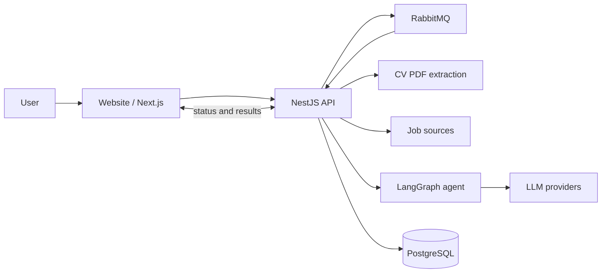
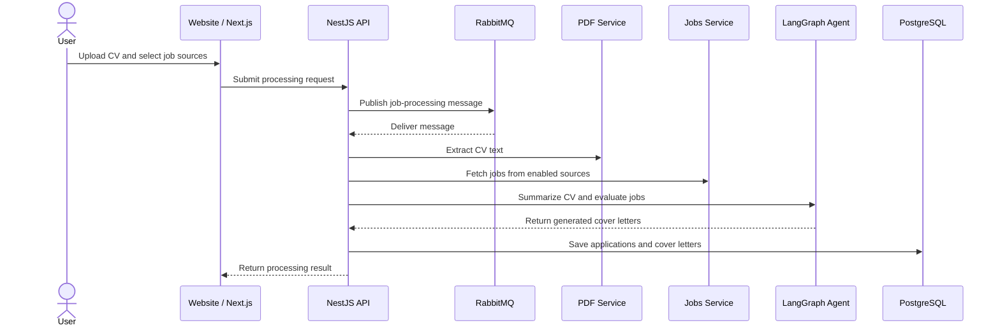
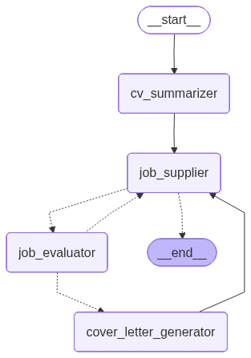

# Job Applicator

Job Applicator helps you discover jobs from multiple sources, evaluate how well your CV matches a role, and generate tailored cover letters.

## Prerequisites

- Node.js and npm installed locally.
- Docker running for the supporting services used by the backend and local development workflow.
- A populated `.env` file at the workspace root with the API, database, queue, and model settings required by your environment.
- Use `.env.example` as the starting point for the workspace `.env` file.

## Required env vars

### Database
- `POSTGRES_HOST` - PostgreSQL host, usually `localhost` for local development.
- `POSTGRES_PORT` - PostgreSQL port, usually `5432`.
- `POSTGRES_USER` - Database user.
- `POSTGRES_PASSWORD` - Database password.
- `POSTGRES_DB` - Database name.

### Queue
- `RABBITMQ_URL` - RabbitMQ connection string, usually `amqp://localhost` for local development.
- `RABBITMQ_QUEUE_PROCESS` - (Optional) Queue name used for job-processing messages. Defaults to `job_application.process`.

### AI & Models
- `EMBEDDING_MODEL` - Model name for generating embeddings (e.g., `nomic-embed-text-v2-moe:latest`).
- `JOB_EVALUATOR_MODEL` - Ollama model name used to evaluate whether a job matches the CV.
- `CV_PARSER_MODEL` - Ollama model name used to parse the CV.
- `COVER_LETTER_GENERATOR_MODEL` - Ollama model name used to generate the cover letter.
- `CRITIQUE_MODEL` - Ollama model name used to critique and rewrite the cover letter.
- `OLLAMA_BASE_URL` - Base URL for the Ollama API (e.g., `http://localhost:11434`).
- `OLLAMA_EMBEDDING_BASE_URL` - Base URL for the Ollama embedding API.
- `OLLAMA_API_KEY` - (Optional) API key for Ollama if running behind an authenticated proxy.

### Storage
- `STORAGE_DIR` - Path to the directory where CVs and uploads are stored.

## Optional but supported

### Gemini Configuration
If `GEMINI_API_KEY` is set, the app can use Gemini models instead of Ollama for supported tasks.
- `GEMINI_API_KEY` - Google Gemini API key.
- `GEMINI_CV_PARSER_MODEL` - Gemini model for CV parsing (Default: `gemini-3.1-flash-lite-preview`).
- `GEMINI_JOB_EVALUATOR_MODEL` - Gemini model for job evaluation (Default: `gemini-3.1-flash-lite-preview`).
- `GEMINI_COVER_LETTER_GENERATOR_MODEL` - Gemini model for cover letter generation (Default: `gemini-3.1-flash-lite-preview`).
- `GEMINI_CRITIQUE_MODEL` - Gemini model for cover letter critique (Default: `gemini-3.1-flash-lite-preview`).

### LangSmith Tracing
- `LANGSMITH_PROJECT` - LangSmith project name for tracing.
- `LANGSMITH_TRACING` - Set to `true` to enable LangSmith tracing.
- `LANGSMITH_API_KEY` - LangSmith API key.

### Other
- `NODE_ENV` - Environment mode (`development`, `production`, `test`). Defaults to `development`.
- `SKIP_ENV_VALIDATION` - Set to `true` to bypass environment variable validation (useful for builds).

## Run Tasks

### Run all

Start the full workspace with:

```sh
npm run dev-all
```

This runs the Nx development targets for the workspace apps together.

### Run frontend website

Start only the Next.js app with:

```sh
nx dev website
```

### Run backend

Start only the NestJS API with:

```sh
nx serve api
```

The API consumes job-processing messages, executes the LangGraph workflow, and persists the generated cover letters.

### Run Tests

Run the full workspace test suite from the workspace root with:

```sh
npm test
```

This runs every Nx `test` target in the repository, including the API integration tests.

Run only unit tests from the workspace root with:

```sh
npm run test:unit
```

This runs every Nx `test` target while ignoring `integration.spec.ts` files.

Run the API test suite from the workspace root with:

```sh
npm run test-integration:api
```

This runs the Nx Jest target for `apps/api` and picks up the `*.integration.spec.ts` files under `apps/api/src/`.

The current API test coverage is the CV embedding integration spec, so make sure local Ollama is running and these models are available:

- `OLLAMA_BASE_URL` - should point to your local Ollama server, usually `http://localhost:11434`.
- `gemma4:e2b` - model used by `CvEmbeddingsService`.
- `nomic-embed-text-v2-moe:latest` - embedding model used by `CvEmbeddingsService`.

## AI Evaluation

The `apps/ai-evaluation/` app contains LangSmith-based evaluation scripts for the job evaluator and graph flows.

Run them from the workspace root:

```sh
npm run ai-eval:node-job-evaluator
npm run ai-eval:graph
```

Each command seeds its dataset if needed and then runs the matching `eval.ts` file.

The eval app reads its own config from `apps/ai-evaluation/.env` and still depends on the workspace root `.env` through the shared env loader.

Required for the eval app:

- `GRADER_LLM_MODEL` - model used to score graph evaluation output.

Optional for the eval app:

- `GEMINI_API_KEY` - required when the grader model is a Gemini model.
- `OLLAMA_BASE_URL` - required when the evaluator graph uses Ollama.
- `SKIP_ENV_VALIDATION=true` - bypasses env validation for local scripting.

## Database Migrations

Run the TypeORM migration from the workspace root with:

```sh
npm run migrate
```

This uses the migration datasource at `libs/migrations/migration-data-source.cjs` and applies migrations from `libs/migrations/`.

If you need to wipe the local schema and rebuild it from migrations, run:

```sh
npm run db:reset
```

This drops every table in the `public` schema and then reruns migrations.

## Used Technologies

- **Nx** for monorepo orchestration and task execution.
- **Next.js** for the website frontend.
- **NestJS** for the API and message-driven backend workflow.
- **React** and **TypeScript** for the UI layer.
- **Tailwind CSS** for styling.
- **PostgreSQL** with **TypeORM** for persistence.
- **RabbitMQ** with `amqplib` for asynchronous job processing.
- **LangChain** and **LangGraph** for the AI agent workflow.
- **Jest** and **Playwright** for automated testing.

## Project Architecture

The repository is organized as an Nx monorepo:

- `apps/website/` contains the Next.js application.
- `apps/api/` contains the NestJS service that processes job data and runs the agent workflow.
- `apps/website-e2e/` contains Playwright end-to-end tests.
- `libs/shared/` is available for reusable workspace utilities.
- `libs/migrations/` contains TypeORM migrations and the migration datasource.

### Component Diagram

The website collects user input and triggers backend job-processing flows. The API fetches job listings, reads the candidate CV, runs the AI workflow, and stores the resulting applications back in the database.



### Sequence Diagram

1. The website submits a CV file and processing preferences.
2. The API receives the message from RabbitMQ.
3. The API extracts text from the uploaded CV and fetches jobs from enabled sources.
4. The LangGraph agent summarizes the CV, evaluates each job, and generates cover letters for matching roles.
5. The API persists the generated cover letters and application data.



## AI Agents

The AI workflow is implemented with LangGraph in `apps/api/src/app/ai/langgraph/`.



The main graph works as follows:

- `cv_summarizer` reduces the uploaded CV into a compact summary optimized for downstream evaluation.
- `job_supplier` iterates through the fetched jobs one by one.
- `job_evaluator` checks whether the current job is a meaningful match for the candidate.
- `cover_letter_generator` creates a tailored cover letter for matched jobs.
- `CoverLetterGraph` adds a critique-and-rewrite loop so the generated letter is refined before it is stored.

The graph keeps track of how many jobs have already been processed and stops once it reaches the configured maximum.

## Production deployment

### Docker

To start the full stack with an empty database and profile intended for a fresh state, run:

```sh
docker compose --profile "*" up -d
```

To start the normal stack using the persisted database and configuration, run:

```sh
docker compose up -d
```

To build a docker container for API, run the following command:

```sh
docker build --no-cache --progress=plain -f apps/api/Dockerfile -t job-applicator-api:latest .
```

To build a docker container for the website, run the following command:

```sh
docker build --no-cache --progress=plain -f apps/website/Dockerfile -t job-applicator-website:latest .
```

To run the website in a docker container, use the command below. Note that the container requires several environment variables (such as `STORAGE_DIR`, `RABBITMQ_URL`, and `POSTGRES_*`) to boot correctly. It is recommended to use an `--env-file` or prefer running via the `docker-compose.yml` file as the standalone `docker run` will not boot as-is without these variables:

```sh
docker run -d -p 3000:3000 job-applicator-website:latest
```
